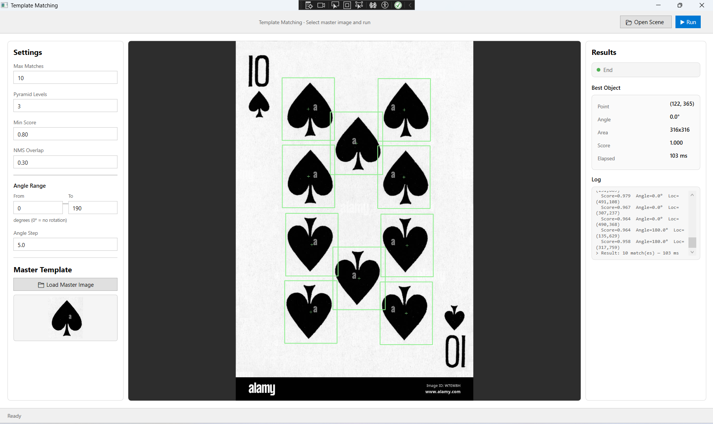

# 🔁 Rotation‑Invariant Template Matching with OpenCvSharp

A Windows WPF application that detects multiple rotated instances of a template image inside a larger scene using OpenCvSharp (C# bindings for OpenCV). It implements a coarse‑to‑fine pyramid search, rotated template generation, and Non‑Maximum Suppression (NMS) for fast, robust multi‑object industrial vision detection.

## ⚙️ Technical Highlights

* Pure OpenCvSharp: All computer vision logic utilizes native types like Mat, Point, Rect, RotatedRect, and Scalar.
* Parallel Processing: Angular search spaces are processed concurrently using Parallel.For to maximize CPU utilization.
* Memory Efficient: Strict memory management with explicit .Dispose() calls on temporary matrices to prevent leaks during heavy matching loops.
* Thread‑Safe Accumulation: Uses ConcurrentBag<MatchResult> to safely gather candidate matches across parallel threads.
* Zero External Dependencies: Built with pure WPF styling without requiring heavy third-party resource dictionaries.

---

## 🚀 Getting Started

### Prerequisites
* Windows 10 / 11
* .NET 6.0 SDK (https://dotnet.microsoft.com/en-us/download) or later
* Visual Studio 2022 (or any compatible C# IDE)

### Install OpenCvSharp and Dependencies

This project relies on OpenCvSharp4. You can install the required NuGet packages via Package Manager Console:

Install-Package OpenCvSharp4.Windows
Install-Package OpenCvSharp4.WpfExtensions
Install-Package OpenCvSharp4.runtime.windows

Or using the .NET CLI:

dotnet add package OpenCvSharp4.Windows
dotnet add package OpenCvSharp4.WpfExtensions
dotnet add package OpenCvSharp4.runtime.windows

### Build & Run

# Clone the repository
git clone https://github.com/NgDong1808/Template-matching-for-multiple-rotated-instances-using-OpencvSharp.git

# Navigate to the project directory
cd Template-matching-for-multiple-rotated-instances-using-OpencvSharp

# Restore dependencies and run
dotnet restore
dotnet build
dotnet run

---

## 📁 Project Structure

📂 TemplateMatching
├── 📁 bin/                    # Compiled binaries
├── 📁 Image/                  # Sample input images (scene + master template)
├── 📁 obj/                    # Intermediate build objects
├── 📁 Result/                 # Output screenshots and test results
├── 📄 App.xaml                # Application resources
├── 📄 App.xaml.cs             # App startup logic
├── 📄 AssemblyInfo.cs         # Assembly metadata
├── 📄 MainWindow.xaml         # WPF UI Layout and styling
├── 📄 MainWindow.xaml.cs      # Core matching algorithm (Pyramid, Rotation, NMS)
├── 📄 TemplateMatching.csproj # Project configuration file
└── 📄 README.md               # Project documentation

---

## 🎮 Usage

1. Load Scene: Click Open Scene and select a large target image (e.g., from the Image/ folder).
2. Load Master: Click Load Master Image and select the small template object you want to find.
3. Adjust Parameters: Fine-tune the detection settings in the UI panel according to your dataset.
4. Run: Click Run to execute the multi-threaded matching process.
5. View Results: The detected objects will be highlighted directly on the canvas. The execution metrics and detailed logs will appear in the right-hand panel.

### 🎛️ Parameter Guide

| Parameter | Description | Default / Recommended |
| :--- | :--- | :--- |
| Max Matches | Maximum number of detections allowed after NMS filtering. | 10 |
| Pyramid Levels | Down‑sampling steps. Higher values drastically increase speed but might miss very small features. | 3 |
| Min Score | Correlation threshold (0.0 to 1.0). 0.8 ensures highly reliable matching. | 0.80 |
| NMS Overlap | Intersection over Union (IoU) threshold for suppression. Lower means more aggressive blocking of overlapping boxes. | 0.3 |
| Angle From / To | The angular search range in degrees (-180 to 180). | 0 to 360 |
| Angle Step | Angular search granularity. Smaller steps (1 độ) are more precise but slower than coarser steps (5 độ). | 5 |

---

## 🧠 Core Strategy for Multi‑Object & Rotated Object Detection

### 1. Rotation Handling
The master template can be matched at any angle by pre‑rotating the template before each matching step. For every angle in the user‑defined range:
* The template is rotated using an affine warp matrix (Cv2.GetRotationMatrix2D + Cv2.WarpAffine).
* A binary mask is generated simultaneously to exclude invalid padded background areas from the correlation score.
* Image matching is performed using Cv2.MatchTemplate with the CCoeffNormed method.

### 2. Image Pyramid (Multi‑scale)
To maintain high performance and real-time processing speeds, a Gaussian pyramid is built for both the scene and the template master. 
* The coarsest level (pyrLevels - 1) is processed first.
* A lower local score threshold (Min Score - 0.15) is applied at this stage to prevent missing true candidates due to down-sampling resolution loss.

### 3. Coarse‑to‑Fine Search
* Coarse Step: At the lowest pyramid level, a full brute-force angular scan is performed. Every pixel location that passes the lowered threshold is recorded as a coarse candidate.
* Fine Step: For each coarse candidate, its location is mapped back to the full‑resolution scene, and a small localized bounding window is cropped. The full‑size template is rotated *only* at the candidate's specific angle and matched strictly within that cropped window.
* Result: This strategy reduces the algorithmic search space and runtime by >80% compared to a full-resolution global angle scan.

---

## 📄 License

This project is licensed under the MIT License - free for both academic and commercial use.